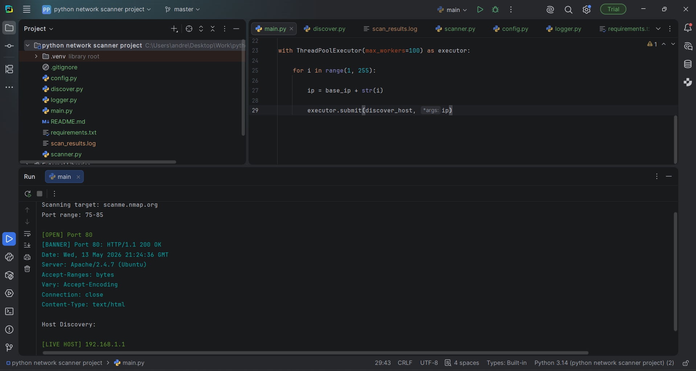

# Python Network Scanner

A Python-based multithreaded network scanner for active reconnaissance and service enumeration.

Supports:
- TCP port scanning
- concurrent scanning
- banner grabbing
- host discovery
- logging
- CLI arguments

---

## Features

- Scan custom port ranges
- Detect open ports
- Grab service banners
- Discover live hosts on local subnet
- Concurrent scanning with ThreadPoolExecutor
- Timestamped logging
- Professional CLI interface using argparse

---

## Technologies Used

- Python
- socket
- threading
- concurrent.futures
- argparse
- colorama

---

## Installation

Clone the repository:

```bash
git clone https://github.com/YOUR_USERNAME/python-network-scanner.git
cd python-network-scanner
```

Install dependencies:

```bash
pip install -r requirements.txt
```

---

## Usage

### Scan Target

```bash
python main.py --target scanme.nmap.org --start 75 --end 85
```

### Help Menu

```bash
python main.py --help
```

---

## Example Output



---

## Features Demonstrated

- TCP socket programming
- concurrent execution
- synchronization locks
- service enumeration
- host discovery
- CLI tooling
- modular Python architecture

---

## Why I Built This

I built this project to better understand:
- TCP networking
- active reconnaissance
- concurrent scanning
- service enumeration
- multithreaded application design

The goal was to build a realistic cybersecurity-oriented networking utility rather than a simple Python script.

---

## Future Improvements

- subnet input via CLI
- CSV / JSON export
- service name mapping
- ICMP ping sweep
- automatic scanning of discovered hosts

---

## Disclaimer

This project is intended for educational and authorized testing purposes only.